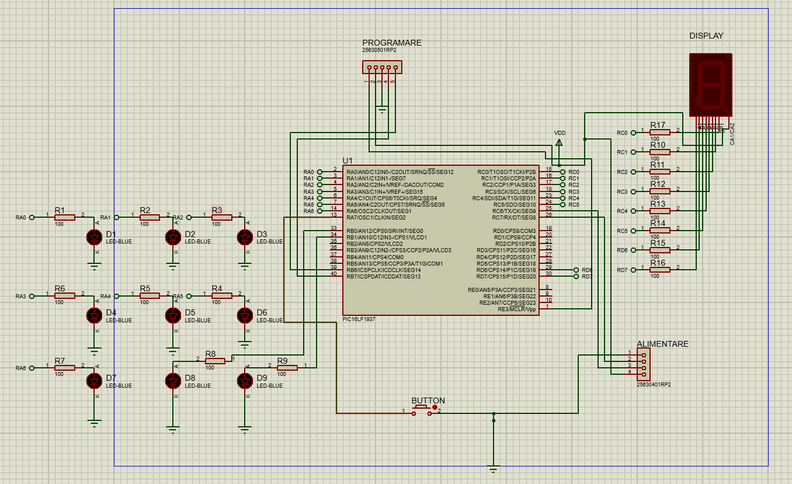
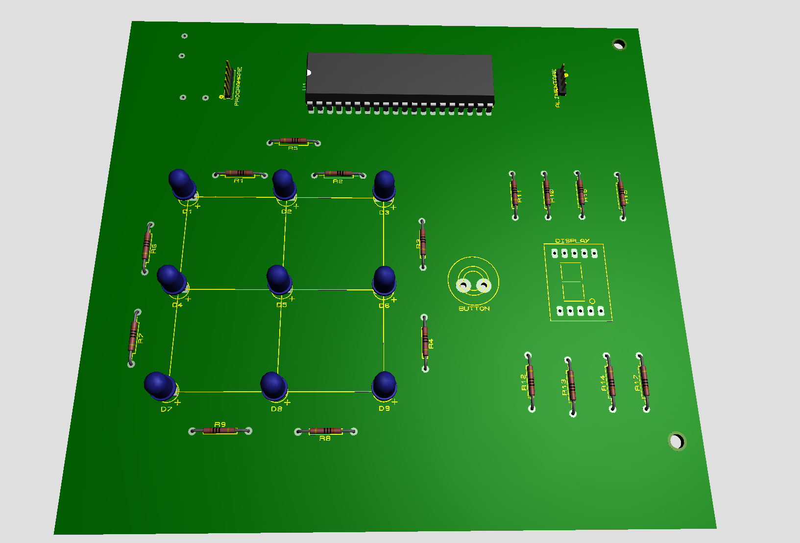

# Electronic Dice (Zar electronic)

A single-button electronic die built around a **Microchip PIC16LF1937**.
Holding the button "rolls" the die: nine LEDs arranged as a 3×3 pip grid flash
through the faces while a 7‑segment display shows the numeric value. When the
button is released the animation runs out and the die settles on a face.

The project is captured as a **Proteus Design Suite 8** project (`dice.pdsprj`)
containing the schematic, the PCB layout, the manufacturing (CADCAM/Gerber)
output and the C firmware that runs on the simulated / real MCU.

### Schematic



### PCB — 3D view



A full schematic / documentation sheet is also exported as
[`dice.PDF`](dice.PDF).

---

## 1. Behaviour

The firmware keeps a frame counter `c` that runs `0 → 11` and wraps. Each value
of `c` paints one die face on the pips **and** the matching digit `1…6` on the
7‑segment display. The faces therefore cycle `1 2 3 4 5 6 1 2 3 4 5 6`, with the
second pass using alternative pip arrangements for 2 and 3 so the roll looks
livelier.

| Button state | What happens |
|---|---|
| **Pressed / held** | `c` is incremented on every pass of the main loop, so the pips and digit blur through the faces. The "slow‑down" counter `b` is (re)loaded with `1500`. |
| **Released** | `b` counts down by 1 each loop pass; every time it reaches a multiple of 100 the frame advances once. That gives ~15 more steps, gradually spaced out by the countdown, and then the die stops. |
| **Idle** (`b == 0`) | The last face stays lit until the button is pressed again. |

Because the button release is not correlated with the internal counter, the
resting face is effectively random (1–6).

| Frame `c` | Face | Pips lit | 7‑seg digit (`v[]`) |
|:--:|:--:|---|:--:|
| 0 | 1 | D5 | `v[1]` |
| 1 | 2 | D1 D9 | `v[2]` |
| 2 | 3 | D1 D5 D9 | `v[3]` |
| 3 | 4 | D1 D3 D7 D9 | `v[4]` |
| 4 | 5 | D1 D3 D5 D7 D9 | `v[5]` |
| 5 | 6 | D1 D3 D4 D6 D7 D9 | `v[6]` |
| 6 | 1 | D5 | `v[1]` |
| 7 | 2 | D3 D7 | `v[2]` |
| 8 | 3 | D3 D5 D7 | `v[3]` |
| 9 | 4 | D1 D3 D7 D9 | `v[4]` |
| 10 | 5 | D1 D3 D5 D7 D9 | `v[5]` |
| 11 | 6 | D1 D2 D3 D7 D8 D9 | `v[6]` |

---

## 2. Repository layout

```
dice.pdsprj                          Proteus 8 project (schematic + PCB + firmware link)
dice.PDF                             Rendered schematic / documentation sheet
dice.EDF                             Proteus electrical design (netlist) export
dice.DO                              Autorouter command script

dice - CADCAM *.GBR                  Gerber artwork (see §6)
dice - CADCAM Drill TOP-BOT Plated.GBR   NC drill data
dice - CADCAM Netlist.IPC            IPC‑356 netlist for bare-board test
dice - CADCAM READ-ME.TXT            Labcenter tool-info file: aperture list & layer stackup

_firmware_extras/
  FIRMWARE.XML                       Firmware family / compiler descriptor
  FIRMWARE/
    PIC16LF1937.XML                  VSM Studio sub-project (build options)
    PIC16LF1937/
      main.c                         >>> the firmware source <<<
      Debug/                         XC8 build output (git-ignored, regenerated)
```

A copy of the firmware source also lives inside `dice.pdsprj` (a ZIP archive).
The unpacked copy under `_firmware_extras/` is the reference version and the one
GitHub diffs — open the project in Proteus and rebuild to sync the embedded copy.

Auto-generated Proteus files (`*.pdsbak`, `Project Backups/`, `*.workspace`,
`*.sts`, `bestsave.rte`, print spools) are excluded via `.gitignore`.

---

## 3. Hardware

### 3.1 Bill of materials

| Ref | Qty | Part | Notes |
|---|:--:|---|---|
| U1 | 1 | PIC16LF1937, 40‑pin PDIP | 8‑bit MCU, internal 16 MHz oscillator |
| D1–D9 | 9 | LED (pip) | 3×3 grid, anode fed from the MCU through a series resistor |
| DISPLAY | 1 | 7‑segment display, **common anode** | segment order on this board is `a b c d e g f dp` (f and g swapped vs. textbook) |
| BUTTON | 1 | Tactile push-button | to GND, active-low on RA7 |
| R1–R9 | 9 | LED series resistors | one per pip |
| R10–R17 | 8 | 7‑segment series resistors | one per segment (a…g + dp) |
| PROGRAM | 1 | 5‑pin ICSP header | MCLR/VPP, VDD, VSS, PGD, PGC |
| ALIMENTARE | 1 | Power / UART connector | VDD, GND and RC6/RC7 |

*(Reference designators and counts are taken from `dice - CADCAM Netlist.IPC`;
resistor roles are inferred from the schematic net names.)*

### 3.2 MCU pin map

| Port pin | Direction | Function |
|---|---|---|
| RA0 | out | `LED1` (pip D1) |
| RA1 | out | `LED2` (pip D2) |
| RA2 | out | `LED3` (pip D3) |
| RA3 | out | `LED4` (pip D4) |
| RA4 | out | `LED5` (pip D5 – centre) |
| RA5 | out | `LED6` (pip D6) |
| RA6 | out | `LED7` (pip D7) |
| RA7 | in (read) | Button, active-low (`BUTTON == !RA7`) |
| RB0 | out | `LED8` (pip D8) |
| RB1 | out | `LED9` (pip D9) |
| RC0–RC7 | out | 7‑segment pattern — the firmware writes the whole `PORTC` |
| RD0–RD7 | out | 7‑segment pattern — the firmware writes the whole `PORTD` |

All pip LEDs are driven **HIGH = LED on** (pin → resistor → LED anode,
cathode → GND). The seven-segment digit is written to `PORTC` **and** `PORTD`
with the same byte `v[n]`; on the PCB only the wired segment lines are used.

> **Note:** the firmware writes the full `PORTC`/`PORTD` bytes, so RC6/RC7 (the
> ALIMENTARE / UART pins) are also driven. If you later add UART traffic on
> those pins, switch the segment output to a read‑modify‑write that masks
> RC6/RC7.

### 3.3 Pip (LED) layout

```
   D1   D2   D3
   D4   D5   D6
   D7   D8   D9
```

| Face | Pips lit |
|:--:|---|
| 1 | D5 |
| 2 | D1 D9  (or D3 D7) |
| 3 | D1 D5 D9  (or D3 D5 D7) |
| 4 | D1 D3 D7 D9 |
| 5 | D1 D3 D5 D7 D9 |
| 6 | D1 D3 D4 D6 D7 D9  (frame 11: D1 D2 D3 D7 D8 D9) |

### 3.4 Button

`RA7 → button → GND`, read as `#define BUTTON !RA7` — pressed = line low =
`BUTTON` true. PORTA on the PIC16F1937 has **no internal weak pull-ups**, so an
external pull-up resistor from RA7 to VDD is required for a reliable high level
when the button is open.

### 3.5 7‑segment display

Common-anode; the common-anode pin(s) tie to VDD, so the MCU sinks each
segment and a segment bit of `0` lights that segment. On this board the physical
bit order is `a, b, c, d, e, g, f, dp` (**f and g are swapped**). The values in
`v[1]…v[6]` are pre-computed for that bit order and the active-low wiring.

### 3.6 ICSP programming header (PROGRAM)

Standard 5-pin Microchip in-circuit serial programming layout: `VPP/MCLR`,
`VDD`, `VSS`, `PGD` (ICSPDAT), `PGC` (ICSPCLK). Compatible with PICkit / ICD.

---

## 4. Firmware

Source: [`_firmware_extras/FIRMWARE/PIC16LF1937/main.c`](_firmware_extras/FIRMWARE/PIC16LF1937/main.c)

### 4.1 Toolchain

* **Compiler:** Microchip MPLAB XC8 (invoked in C90 / `--pass1` mode by Proteus VSM Studio)
* **Target:** `PIC16LF1937`
* **Build configurations:** `Debug` (produces `.cof` for Proteus simulation) and `Release` (produces Intel HEX). Options are stored in `_firmware_extras/FIRMWARE/PIC16LF1937.XML`.

### 4.2 Configuration words

Set directly in `main.c`:

```c
__PROG_CONFIG(1, 0x3FE4);   // INTOSC, WDT off, MCLR enabled, CLKOUT off, PWRTE, BOR
__PROG_CONFIG(2, 0x1EFF);   // no PLL / LVP quirks
#define _XTAL_FREQ 16000000  // 16 MHz
```

`init()` selects the 16 MHz HF internal oscillator (`OSCCON = 0x7B`), makes
every I/O port an output, turns all analog functions off
(`ANSELA = ANSELB = 0`), pre-sets `PORTA = 0b1000_0000` (RA7 bit high, pips
off) and clears the other latches.

### 4.3 Program flow

```
main()
 ├─ init()                       ports, oscillator, Timer1 + interrupts
 ├─ c = 0                        current frame 0..11
 ├─ b = 0                        slow-down countdown
 └─ forever:
      if (BUTTON)                held → roll
          c = (c + 1) % 12
          b = 1500
          PORTA = 0b10000000     pips off for this pass
      else if (b > 0)            released → run the roll out
          b--
          if (b % 100 == 0)
              c = (c + 1) % 12

      // then a 12-way if/else chain on c:
      //   set LED1..LED9 for the face
      //   PORTC = v[digit];  PORTD = v[digit];
```

There is no `__delay_ms()` in the loop — the roll speed is simply how fast the
loop runs, and the `b` countdown stretches the last ~15 frames before the die
stops.

### 4.4 Segment pattern table

```c
unsigned char v[10] = { 0x03, 0x9F, 0x25, 0x0D, 0x99, 0x49, 0x41, 0x1F, 0x01, 0x09 };
//                        0     1     2     3     4     5     6     7     8     9
```

Only `v[1]`…`v[6]` are used (digits 1–6). The bytes already account for the
`a b c d e g f dp` bit order and the common-anode (active-low) wiring of this
board.

### 4.5 Timer1 interrupt

`T1CON = 0x11` runs Timer1 from Fosc/4 with a 1:2 prescale; the ISR clears the
flag, reloads `TMR1H:TMR1L = 0x3CAF` for a ~25 ms overflow and increments a
counter `a`. This tick is **currently unused** by the game loop — it is wired up
and available for a future feature (auto-sleep, seeded RNG, etc.).

### 4.6 Building & flashing

1. Open `dice.pdsprj` in Proteus and use the built-in VSM Studio, **or** create
   an MPLAB X project targeting `PIC16LF1937` and add `main.c`.
2. Build the **Release** configuration to get `dice.hex`.
3. Flash with a PICkit 3/4 (or ICD) through the **PROGRAM** header:
   `VPP, VDD, VSS, PGD, PGC`.
4. First power-up: press and hold the button, release, and the die runs the roll
   out and settles on a face.

---

## 5. Simulating in Proteus

1. Open `dice.pdsprj` (Proteus 8.9 or newer — the CADCAM output was generated
   with 8.9 SP0).
2. The schematic already links the firmware project; press **Run** and click the
   on-screen button to roll.
3. If the firmware link is broken, double-click U1 → *Edit Firmware Project* and
   point it at `_firmware_extras/FIRMWARE/PIC16LF1937/main.c`.

---

## 6. PCB & manufacturing

Two-layer FR‑4 board. Gerber set (Proteus CADCAM, X2 ASCII, 4.3, metric,
absolute):

| File | Layer |
|---|---|
| `dice - CADCAM Top Copper.GBR` | Top copper |
| `dice - CADCAM Bottom Copper.GBR` | Bottom copper |
| `dice - CADCAM Top Silk Screen.GBR` | Top silkscreen |
| `dice - CADCAM Top Solder Resist.GBR` | Top solder mask |
| `dice - CADCAM Bottom Solder Resist.GBR` | Bottom solder mask |
| `dice - CADCAM Top Assembly.GBR` | Assembly / component outlines |
| `dice - CADCAM Mechanical 1.GBR` | Board outline |
| `dice - CADCAM Drill TOP-BOT Plated.GBR` | Plated through-hole drill data |
| `dice - CADCAM Netlist.IPC` | IPC‑356 net list (bare-board test) |

**Layer stackup** (from `dice - CADCAM READ-ME.TXT`):

| Layer | Thickness | Material |
|---|---|---|
| Top solder resist | 0.010 mm | Resist |
| Top copper | 0.018 mm | Copper |
| Core | 1.550 mm | FR4 |
| Bottom copper | 0.018 mm | Copper |
| Bottom solder resist | 0.010 mm | Resist |

Send the eight `.GBR` files plus the drill file to any board house, or re-run
**Output → Generate CADCAM Files** in Proteus to regenerate them.

---

## 7. Credits

* Design & firmware: **Ailenei Daniel**
* Captured in Labcenter **Proteus 8.9**, firmware built with **Microchip MPLAB XC8**.
